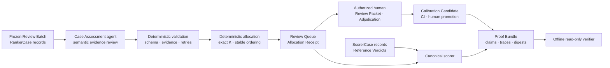

<div align="center">

# EdgeQueue

### Find the wrong agent verdicts first.

**EdgeQueue helps evaluation teams spend a fixed expert-review budget on the agent verdicts most likely to be wrong—and proves why each case was selected.**

[GitHub](https://github.com/degencodebeast/edge-queue) · [Measured result](#measured-result) · [How it works](#how-it-works) · [Run it locally](#run-it-locally) · [Improvement Changelog](IMPROVEMENT_CHANGELOG.md)

Built for the **micro1 Agentic Workflows Hackathon**.

</div>

---

## The problem

Evaluation Operations Leads can receive more agent trajectories and evaluator verdicts than qualified reviewers can inspect.

Common queues review the lowest-confidence cases first. Others prioritize evaluator disagreement or simple deterministic warning signals. These policies can miss confidently wrong verdicts. They can also spend scarce review time on difficult cases whose verdicts are already correct.

The result is an allocation problem: **which `K` cases should a human review when the batch contains `N` cases and `K < N`?**

EdgeQueue treats expert attention as a fixed Review Budget. It ranks likely Label Errors, links every selection to trajectory evidence, and leaves every canonical correction under human control.

## What EdgeQueue does

The complete workflow is:

<div align="center">

**`FREEZE → RANK → REVIEW → CORRECT → REPLAY → PROVE`**

</div>

1. **Freeze** — bind the corpus, split, configuration, and scorer-only labels to content digests.
2. **Rank** — an agent produces one structured Case Assessment from allocator-visible evidence only.
3. **Review** — deterministic code validates assessments, enforces exactly `K`, and creates an ordered Review Queue and Allocation Receipt.
4. **Correct** — an authorized human reviews the evidence and records an append-only Adjudication.
5. **Replay** — a correction can become a Calibration Candidate, but deterministic CI and a separate human promotion gate control adoption.
6. **Prove** — a Proof Bundle binds inputs, outputs, metrics, claims, and versions. An offline verifier recomputes the result and rejects tampering.

The agent performs the semantic task: finding contradictions between a verdict and its evidence. Deterministic code owns validation, ordering, budget enforcement, scoring, digests, and receipts. A human owns the final correction.

## Measured result

EdgeQueue was compared with simple allocators on the same frozen synthetic Allocation Holdout and the same Review Budget.

| Allocator | Cases | Review Budget | Label Error Recall@8 | Precision@8 |
|---|---:|---:|---:|---:|
| **EdgeQueue** | 40 | 8 | **0.80** in each of three runs | **1.00** |
| Strongest defined simple baseline | 40 | 8 | 0.00 | 0.00 |
| Seeded random, 95th percentile | 40 | 8 | 0.40 | — |
| Oracle ceiling | 40 | 8 | 0.80 | 1.00 |

EdgeQueue recovered 8 of the 10 hidden Label Errors while reviewing 8 of 40 cases. The strongest simple baseline recovered none under the same budget. The comparison uses 1,000 seeded random allocations and reports all three EdgeQueue runs.

The result is intentionally narrow. It applies to this frozen synthetic corpus. It does not establish production generality or statistical significance.

Evidence:

- [`runs/allocation-holdout/evaluation.json`](runs/allocation-holdout/evaluation.json) preserves every queue and metric.
- [`runs/development/evaluation.json`](runs/development/evaluation.json) preserves the Development result.
- [`scripts/check_holdout_leakage.py`](scripts/check_holdout_leakage.py) checks that scorer-only fields and sentinels did not enter allocator traces.
- [`IMPROVEMENT_CHANGELOG.md`](IMPROVEMENT_CHANGELOG.md) connects each material change to its evidence and next decision.

## Why it is different

### Confidence is a signal, not a review policy

A confident evaluator can still be wrong. Low-confidence-first allocation missed every hidden Label Error in the holdout used here.

### Agents advise; deterministic code decides

The Case Assessment agent cannot choose `K`, alter the Review Batch, create authoritative metrics, or correct a Verdict. Those controls remain deterministic and testable.

### Hidden labels stay hidden

The allocator receives RankerCase records. The canonical scorer receives separate ScorerCase records. Per-case sentinels and leakage scans test this boundary.

### Verification does not trust reported metrics

The offline verifier recomputes metrics from authoritative records. It rejects a metric tamper even when an attacker repairs the surrounding file digests.

## How it works



ScorerCase data never enters the Case Assessment agent context. The human decision does not rewrite history. Each record is append-only or content-bound.

## Run it locally

### Requirements

- Python 3.11 or newer
- [`uv`](https://docs.astral.sh/uv/)
- No API key for tests, scoring, or proof verification

### Install

```bash
git clone https://github.com/degencodebeast/edge-queue
cd edge-queue
uv sync --frozen
```

### Run the tests

```bash
uv run pytest -q
```

### Recompute the baseline and allocation results

```bash
uv run python scripts/score_development.py
uv run python scripts/score_allocation_holdout.py
uv run python scripts/check_holdout_leakage.py
```

These commands use preserved model outputs. They make no model or network calls.

### Inspect the command interfaces

```bash
uv run edgequeue judge --help
uv run edgequeue adjudicate --help
uv run edgequeue verify --help
```

The final release package will put the complete four-case Judge Fixture behind `edgequeue judge`. Until that slice lands, the full test suite is the authoritative executable path.

## Human correction and calibration

The HTML Review Packet lets a reviewer inspect the selected Case Assessment, supporting events, and the first excluded case. The `adjudicate` command checks the frozen Reviewer Manifest before it appends a decision.

A corrected case can become a Calibration Candidate. Calibration CI compares the candidate with frozen Development and Post-Calibration Holdout cases. The candidate cannot promote itself. A qualified human with the required role must authorize promotion.

This separation prevents a plausible agent explanation from silently becoming canonical evaluation guidance.

## Proof and tamper rejection

A Proof Bundle declares every included artifact and its content digest. Verification performs three independent checks:

1. Confirm the manifest and declared file digests.
2. Recompute metrics and claims from authoritative inputs.
3. Check corpus, split, budget, calibration, evidence, and human-authority bindings.

The verifier is offline and read-only. Tests include a repaired-digest attack where metrics are changed and all outer hashes are updated. Verification still fails with a named semantic error.

## Improvement Changelog

The full experiment history is in [`IMPROVEMENT_CHANGELOG.md`](IMPROVEMENT_CHANGELOG.md). The main progression is:

| Stage | What changed | Evidence-led decision |
|---|---|---|
| Baseline | Lowest confidence, disagreement, deterministic risk, and seeded random allocation | Keep fair same-case, same-budget comparisons. |
| Semantic ranking | Added evidence-linked Case Assessments | Keep agent judgment only where semantic interpretation adds value. |
| Deterministic authority | Added exact-budget ordering, canonical scoring, and Allocation Receipts | Do not let agent prose become an authoritative result. |
| Scorer isolation | Split RankerCase and ScorerCase data and added sentinels | Reject any run where hidden labels enter allocator evidence. |
| Human correction | Added append-only authorized Adjudications | Keep canonical corrections under qualified human control. |
| Proof | Added manifest-bound verification and repaired-digest tamper tests | Recompute claims instead of trusting reported numbers. |

## Main failure mode and hot take

The most important project failure was corpus drift. A result can keep the same aggregate metric while its exact queue no longer binds to the final frozen inputs. A plausible number is not enough; every input, queue, receipt, metric, and claim must refer to the same immutable evaluation state.

**Hot take:** confidence and evaluator agreement are not review policies. Reliable agent evaluation starts when teams treat human attention as a measurable allocation decision. Let agents identify semantic risk, let deterministic code control consequences, and require evidence before any result becomes a claim.

## What is real and what is limited

| Area | Current status |
|---|---|
| Synthetic corpus | 80 versioned cases across Development, Allocation Holdout, and Post-Calibration Holdout |
| Agent evidence | Preserved prompts, events, final outputs, metadata, retries, runtime, and token accounting |
| Allocation | Fixed-budget deterministic Review Queue with evidence-linked assessments |
| Human authority | Reviewer Manifest checks and append-only Adjudications |
| Calibration | Candidate comparison, regression gates, human promotion, and rollback records |
| Proof | Offline read-only verification with named tamper failures |
| Production claim | **Not made.** Results are limited to the submitted synthetic corpus. |
| Consequential use | Requires approved data and qualified human reviewers. |

The final submission archive will also contain the clean-room report, representative trajectories for every agent role, and the video assets required by the hackathon.

## Agent-use disclosure

This project used coding agents for planning, implementation, internal review, and independent Gate review. The final package preserves representative trajectories for:

- the Controller that assigned work and owned integration;
- Worker agents that implemented bounded tickets;
- read-only Gate agents that reviewed exact candidate commits;
- internal Standards and Specification reviewers;
- the product Case Assessment agent used in the measured evaluation.

The trajectories include instructions, tool responses, retries, review feedback, human checkpoints, and final outcomes. No credential or private personal data belongs in the submission.

## Project layout

```text
src/edgequeue/             Core contracts, ranking, allocation, review, calibration, and verification
schemas/                   Versioned public JSON contracts
corpus/                    Frozen RankerCase and scorer-only ScorerCase records
runs/                      Preserved evaluation trajectories and results
docs/evidence/             Ticket evidence and reproducible reports
tests/                     Contract, behavior, authority, and tamper tests
scripts/                   Evaluation, scoring, leakage, and release commands
IMPROVEMENT_CHANGELOG.md   Evidence-led experiment history
```

## Repository

Source: **[github.com/degencodebeast/edge-queue](https://github.com/degencodebeast/edge-queue)**

The hackathon submission uses a deterministic source archive. The GitHub repository is included here as an additional review path.
