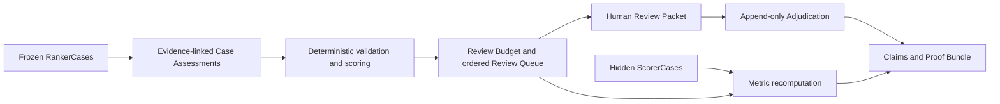

# EdgeQueue

**Find wrong agent verdicts before expert review time runs out.**

```text
4 agent verdicts
1 known Label Error
1 review slot
```

The deterministic baseline spends that slot on the wrong case. EdgeQueue sends the known Label Error to the reviewer.

EdgeQueue helps an Evaluation Operations Lead allocate a fixed Review Budget across agent verdicts. It combines evidence-linked Case Assessments with deterministic validation, scoring, ordering, and budget enforcement. An authorized human owns every correction.

[Run the Judge](#judge-it-in-90-seconds) · [Open the Review Packet](docs/evidence/ticket-21/artifacts/review-packet.html) · [See the results](#measured-results) · [Reproduce the evidence](REPRODUCTION.md) · [Read the changelog](IMPROVEMENT_CHANGELOG.md)

Repository: <https://github.com/degencodebeast/edge-queue>

## Why EdgeQueue exists

Evaluation teams can receive more Trajectory Evaluations than qualified reviewers can inspect. Reviewing every case is too slow. Reviewing only low-confidence cases can miss confident Label Errors.

EdgeQueue turns that bottleneck into a fixed-budget allocation problem:

1. Freeze the same cases for every method.
2. Hide scorer-only labels from the allocator.
3. Ask the ranker for evidence-linked findings or an abstention.
4. Let deterministic code validate records and select exactly `K` cases.
5. Give an authorized reviewer a clear Review Packet.
6. Bind the result, correction, metrics, and claims into a verifiable Proof Bundle.

The ranker advises. Deterministic code controls the queue. A human controls the Verdict.

## Judge it in 90 seconds

Requirements: Python 3.11 or newer and [`uv`](https://docs.astral.sh/uv/).

```sh
git clone https://github.com/degencodebeast/edge-queue
cd edge-queue
uv sync --frozen
UV_OFFLINE=1 uv run edgequeue judge --output-dir /tmp/edgequeue-judge
UV_OFFLINE=1 uv run edgequeue verify /tmp/edgequeue-judge/proof-bundle
```

Expected result:

```text
Baseline deterministic_only: EQ-F02-DEV-01
EdgeQueue: EQ-F01-DEV-01
Primary Recall@1: baseline=0.00 EdgeQueue=1.00
Calibration Candidate: accepted; not promoted; no PCH claim
Proof Bundle: valid
Tamper result: metric_recomputation_mismatch
Offline Replay: about 0.057s, requests=0, tokens=0, model_cost=$0.00
```

This path uses a committed synthetic fixture. It makes no network or model call. Its full evidence is in [`docs/evidence/ticket-21/artifacts/`](docs/evidence/ticket-21/artifacts/).

## What the reviewer sees

The generated [Review Packet](docs/evidence/ticket-21/artifacts/review-packet.html) shows:

- the fixed Review Budget;
- the selected case and its evidence;
- the deterministic risk score;
- why the case crossed the selection boundary;
- the first excluded case;
- the authorized human correction.

In the Judge Fixture, EdgeQueue selects `EQ-F01-DEV-01`. The reviewer changes its canonical Verdict from `FAIL` to `UNDETERMINED`. The correction is append-only and evidence-bound.

## Measured results

EdgeQueue reports the illustrative demo and the broad evaluation separately.

| Evaluation | Cases | Budget | Baseline | EdgeQueue | Decision |
| --- | ---: | ---: | ---: | ---: | --- |
| Judge Fixture, Development | 4 | `K=1` | Recall@1 `0.00` | Recall@1 `1.00` | Illustrative workflow proof |
| Fresh Development | 20 | `K=4` | Strongest baseline Recall@4 `0.60` | Recall@4 `0.20` | No improvement claim |
| Allocation Holdout, three frozen attempts | 40 | `K=8` | Strongest baseline Recall@8 `0.30` | `0.30`, `0.40`, `0.30` | Broad gate rejected |

The Judge Fixture proves the end-to-end behavior on one difficult case. It does not establish broad performance.

The public Allocation Holdout claim is Recall@8 `0.30`, the worst result across three frozen attempts. The mean is `0.333`. The strongest deterministic baseline is `0.30`, and seeded random Recall@8 p95 is `0.40`. The broad gate therefore rejects a general improvement claim.

Authoritative sources:

- [Judge Fixture summary](docs/evidence/ticket-21/artifacts/summary.json)
- [Allocation Holdout claim](docs/evidence/ticket-20/claims.json)
- [Claims Manifest](docs/evidence/ticket-20/claims-manifest.json)
- [Fresh frozen evaluation evidence](docs/evidence/ticket-20/README.md)

## How it works



`RankerCase` records contain only allocator-visible evidence. `ScorerCase` records contain hidden Reference Verdicts and scorer sentinels. Leakage checks keep those surfaces separate.

Case Assessments are non-authoritative. Deterministic code validates their schema, binds them to frozen content, applies the scoring policy, enforces exactly `K` unique known cases, and creates the Allocation Receipt.

The Proof Bundle does not trust saved metrics. Offline verification recomputes bindings and metrics. A hostile bundle with a changed Recall value and repaired file digest still fails with `metric_recomputation_mismatch`.

## What changed during the hackathon

| Iteration | What changed | Outcome |
| --- | --- | --- |
| Fixed-budget baselines | Added fair same-case, same-budget comparators | Established the baseline contract |
| Semantic ranking | Added evidence-linked findings and abstention | Kept semantic judgment without giving it queue authority |
| Scorer isolation | Split allocator-visible and hidden scoring records | Prevented labels from steering allocation |
| Human authority | Added append-only Adjudications | Kept canonical corrections under reviewer control |
| Proof verification | Added content bindings and metric recomputation | Rejected repaired-digest tampering |
| Frozen rerun | Replaced an invalid broad `0.80` result | Published `0.30` and rejected the broad gate |

The most important change was the authority boundary. The agent can explain risk, but deterministic code owns validation and ordering. A human owns the correction.

The removed `0.80` experiment remains documented in [IMPROVEMENT_CHANGELOG.md](IMPROVEMENT_CHANGELOG.md). Authoritative frozen reruns disproved it because its trace inputs did not bind to the final RankerCases.

## Reproduce the evaluation

```sh
UV_OFFLINE=1 uv run python scripts/score_development.py
UV_OFFLINE=1 uv run python scripts/score_allocation_holdout.py
UV_OFFLINE=1 uv run python scripts/check_holdout_leakage.py
uv run pytest -q
```

Expected checkpoints:

- Development EdgeQueue Recall@4: `0.20`.
- Holdout attempts: `0.30`, `0.40`, and `0.30`.
- Holdout decision: `reject`.
- Leakage scan: `checked_files=600 leakage=none`.
- Test suite: `176 passed` in the verified environment.

See [REPRODUCTION.md](REPRODUCTION.md) for setup, runtime, cost, and release-archive commands.

## Technical overview

- Python 3.11 or newer.
- No runtime dependencies.
- `pytest` for verification.
- Versioned JSON Schemas packaged with the wheel.
- Canonical UTF-8 JSON and SHA-256 content digests.
- Offline `judge`, `adjudicate`, and `verify` commands.
- Deterministic ZIP creation with an external SHA-256 sidecar.

```text
src/edgequeue/          allocation, adjudication, proof, and verification code
schemas/                versioned public contracts
corpus/                 frozen synthetic corpus and Judge Fixture
scripts/                evaluation, privacy, trajectory, and release commands
tests/                  contract, public-seam, and submission tests
docs/evidence/          content-bound run and review evidence
docs/trajectories/      redacted Controller, Worker, Gate, and review traces
docs/submission/        copy-ready submission and video plan
```

## Evidence and limits

| Boundary | Status |
| --- | --- |
| Data | Synthetic only |
| Default execution | Credential-free and offline |
| Model calls in Judge Fixture | 0 requests, 0 tokens, `$0.00` model cost |
| Calibration Candidate | Accepted, not promoted |
| Post-Calibration Holdout | Not run |
| Broad improvement claim | Rejected |
| Production-generality claim | Not made |
| Canonical Verdict changes | Authorized human only |

Production use requires qualified reviewers, approved data, and a separately validated live provider path.

## Submission evidence

- [Reproduction guide](REPRODUCTION.md)
- [Improvement Changelog](IMPROVEMENT_CHANGELOG.md)
- [Pre-existing work and provenance](PREEXISTING.md)
- [Copy-ready submission](docs/submission/submission.md)
- [Video script and capture plan](docs/submission/video-production.md)
- [Redacted agent trajectory manifest](docs/trajectories/trace-manifest.json)
- [Submission-readiness report](docs/evidence/ticket-22/submission-readiness.md)
- [Pre-release qualification report](docs/evidence/ticket-23/pre-release-qualification.md)
